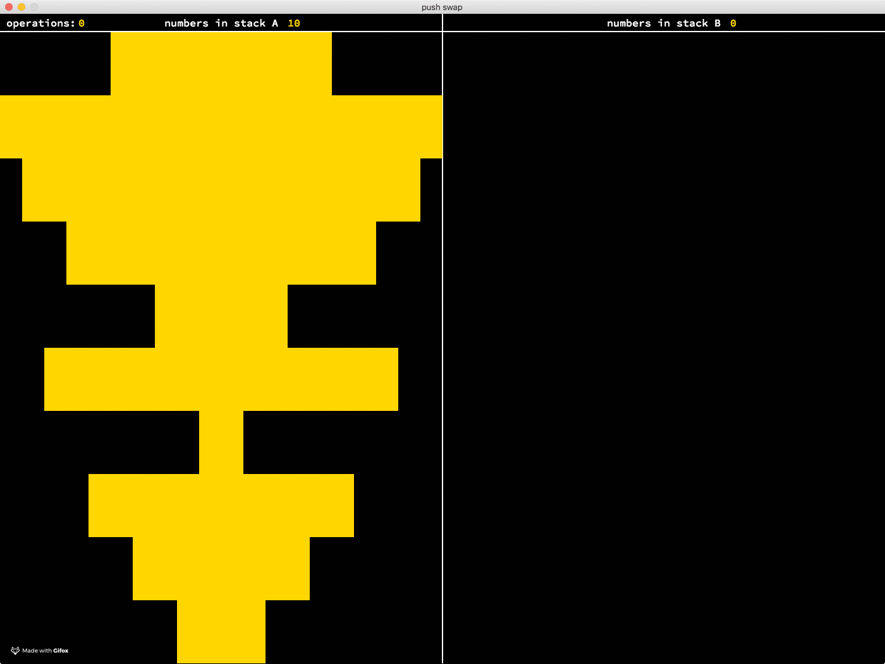
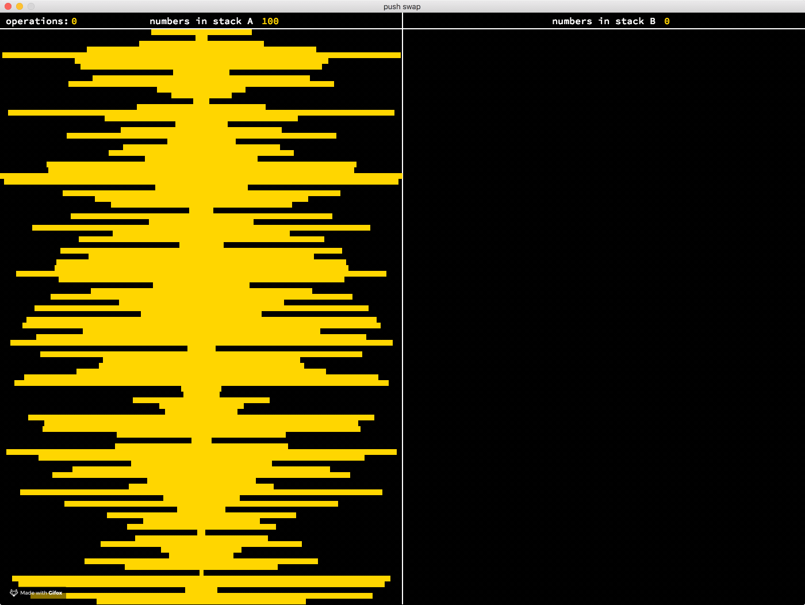

# push_swap

The game is composed of 2 stacks named a and b. At the start a contains
number of integers (INT_MIN..INT_MAX) without any duplicates. b is empty.
The goal is to sort in ascending order numbers into stack a.
To do this you have the following operations at your disposal:


**sa**  : swap a - swap the first 2 elements at the top of stack a.
     Do nothing if there is only one or no elements).

**sb**  : swap b - swap the first 2 elements at the top of stack b.
     Do nothing if there is only one or no elements).

**ss**  : sa and sb at the same time.

**pa**  : push a - take the first element at the top of b and put it at the top of a.
     Do nothing if b is empty.

**pb**  : push b - take the first element at the top of a and put it at the top of b .
     Do nothing if a is empty.

**ra**  : rotate a - shift up all elements of stack a by 1. The first element becomes the last one.

**rb**  : rotate b - shift up all elements of stack b by 1. The first element becomes the last one.

**rr**  : ra and rb at the same time.

**rra** : reverse rotate a - shift down all elements of stack a by 1. The last element becomes the first one.

**rrb** : reverse rotate b - shift down all elements of stack b by 1. The last element becomes the first one.

**rrr** : rra and rrb at the same time


How to use:
```
  ./push_swap 4 5 3 2 1 | ./checker 4 5 3 2 1

  add -v flag as first checker argument for visualization.
  when in visualization mode press Enter for fast forward, RShift for fast back,
  right arrow to move one operation forward, left arrow to move one operation back,
  R for reset and C to change color.
  ./push_swap 4 5 3 2 1 | ./checker -v 4 5 3 2 1

  generate and use 100 random numbers:
  NUMBERS=`ruby -e "puts (1..100).to_a.shuffle.join(' ')"`
  ./push_swap $NUMBERS | ./checker $NUMBERS


  run test script to measure average sorting efficiency:
  sh test.sh 20 50  will run 50 tests on randomly generated arrays of size 20
```

10 random numbers:


100 random numbers:

